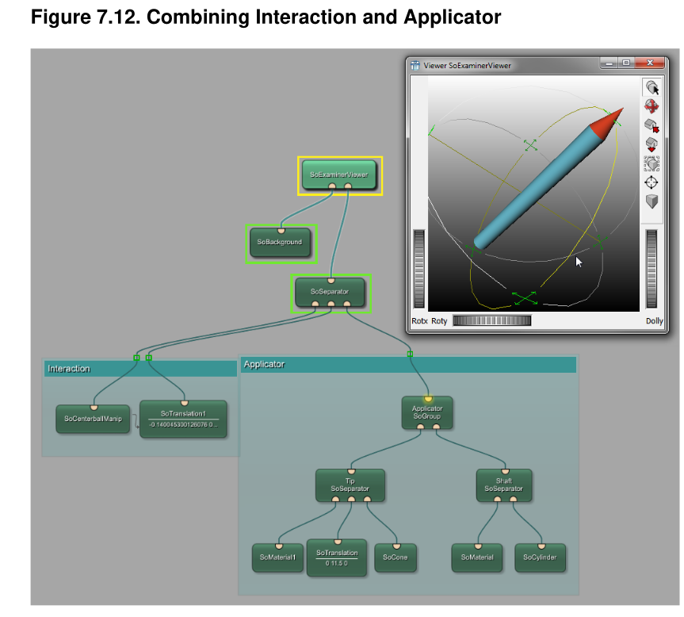

# 1.写在开始之前

[TOC]

## 1.1 欢迎使用MeVisLab  
MeVisLab是一个用于医学图像处理与可视化的快速原型开发平台。借助其图像处理库，它满足以下需求：  
- 能够处理大型六维图像（x、y、z、颜色、时间、用户自定义维度）。  
- 提供便捷方式，用于以模块化C++接口开发新算法，或修改/优化现有算法，非常适合快速发展的研究领域。  
- 支持轻松将算法组合成算法管道和网络。  
- 快速且高效地集成到临床环境中，适配标准接口（如DICOM）。  
- 采用公平的处理方式，使日常任务可通过基于页面的、需求驱动的方法在图像处理中实现。  

除常规图像处理算法和可视化工具外，MeVisLab还包含用于分割、配准、体积测量、定量形态学分析和功能分析的高级医学成像模块。  

基于MeVisLab，已开发出多个临床原型，包括神经成像软件助手、动态图像分析、手术规划和血管分析工具。  

MeVisLab的实现利用了许多知名的第三方库和技术。其中，最重要的是应用程序框架Qt、交互工具包（用于交互模块）、可视化工具包（VTK）以及OpenGL。此外，还基于Insight Toolkit（ITK）和可视化工具包（VTK）开发了开源模块。

## 1.2  文档涵盖内容

阅读本文档，您将熟悉 MeVisLab 的基本功能及使用方法。文档章节将从复杂的可视化编程，到基于 C++ 的模块组装宏模块、编写网络层级模块测试，逐步介绍相关内容。您将了解以下内容：  
- 使用 MeVisLab 的图形化模块/网络接口概念  
- 加载和查看各种格式的 2D、3D 和 4D 图像  
- 通过 SDK 提供的标准模块集，为特定的图像处理、图像可视化或图像交互任务制作原型  
- 让您自定义的 C++ 图像处理算法以自定义模块插件的形式在 MeVisLab 中运行  
- 创建简洁的图形用户界面，用于呈现图像处理和图像可视化管道，实现类似应用程序的功能  
- 编写测试，对模块和网络进行手动测试与自动测试  

### 注意  
根据您的软件许可，MeVisLab 的部分功能可能不可用。有关许可信息，请访问 MeVisLab 网站（https://www.mevislab.de/）。

## 1.3 目标读者  
《入门指南》面向MeVisLab新用户以及希望深入探索其功能的用户。所需的先验知识取决于MeVisLab的使用场景：  
- 若仅创建网络，无需编程知识。  
- 若创建宏模块，需具备基础Python知识。本文档中的示例也会使用MDL（MeVisLab定义语言）。  
- 若开发模块，需具备基础C++知识。  
- 若要充分利用可视化功能，需具备一些图像处理和计算机图形学知识。  

## 1.4 本文档使用的约定  
### 1.4.1 操作  
- **选择**：用鼠标左键单击对象。  
- **右键单击**：用鼠标右键单击对象，通常用于打开上下文菜单。  
- **双击**：快速连续点击对象两次，启动对象的默认操作（例如，对模块而言，会打开默认面板）。  
- **拖动**：用鼠标点击对象，按住鼠标按键，将对象移动到其他位置，松开鼠标按键完成放置/停止。  
- **右键拖动**：用鼠标右键点击对象，按住鼠标按键并移动（操作方式如“拖动”所述）。  
- **鼠标悬停**：将鼠标指针移至对象上，以在工具提示中显示额外信息，如面板和连接器的相关信息。  
- **CTRL+N**：同时按下CTRL键和N键。  
- **ALT+双击**：按住ALT键，双击对象。  
- **菜单项→子菜单项**：打开菜单，选择子菜单项。

### 1.4.2 格式
- **视图**：参数连接检查器  
- **MeVisLab 模块**：ImageLoad  
- **参数**：Diameter  
- **编程代码**：`*outVoxel = *inVoxel0`  
  以及  
  ```  
  outMin = inMin + constValue  
  outMax = inMax + constValue  
  ```

## 1.5 如何阅读本文档  
如果这是您初次接触 MeVisLab，请从**第 2 章《MeVisLab 基础》**开始，接着阅读**第 3 章的第一个网络示例《加载与查看图像》**。  
若您已有使用 MeVisLab 的基础经验，且希望深入学习可视化与场景相关内容，请阅读**第 7 章《创建观察器场景》**。  
若您对 MeVisLab 中所有模块类型均有基础使用经验，并考虑通过脚本扩展网络，请阅读**第 10 章《为应用程序开发宏模块》**。  
若您有使用 MeVisLab 网络的基础经验，并打算用 C++ 编写自定义模块，请从**第 13 章《C++ 模块入门》开始**。  
此外，以下章节可能对您有所帮助：  
- **第 12 章《ML 中的图像处理》**：介绍坐标系背景知识及其在 MeVisLab 中的应用。  
- **第 8 章《开始创建自己的程序包》**：讲解模块数据库的程序包结构，以及如何创建程序包用于开发。

## 1.6 MeVisLab相关文档  
除了手头的这份文档外，还有以下可用文档：  

| 标题 | 内容 |  
|------|------|  
| How to Get Help? | MeVisLab 中可用帮助功能概述 |  
| MeVisLab Reference Manual | MeVisLab 用户界面参考手册 |  
| The ML Guide | MeVis 图像处理库——编程指南 |  
| ML Reference | MeVis 图像处理库——API 说明 |  
| MDL Reference | MeVisLab 定义语言（MDL）面板/图形用户界面参考 |  
| Open Inventor Overview | Open Inventor 模块使用帮助 |  
| Open Inventor Reference | 已实现的 Open Inventor 类（由原始 map 文件转换而来）参考 |  
| Scripting Reference (Python) | MeVisLab 中 Python 脚本参考 |  
| Toolbox Reference | MeVisLab Toolbox 各类 API 库参考 |  
| TestCenter Reference | TestCenter 类参考 |  
| Package Structure | MeVisLab 中关于程序包结构的信息 |  
| ToolRunner | ToolRunner（用于构建项目和帮助文件的独立程序）使用手册 |  
| CMake | MeVisLab 环境下的 CMake 说明，包括如何使用 CMakeLists.txt 文件的解释 |  

如需在在线文档中搜索，使用“Help → Search in Documentation”，详见《MeVisLab 参考手册》中的“Documentation Usage”部分。


## 1.7 术语表（缩略版）  
完整术语表见《ML 指南》。  

### ML、MDL、Open Inventor——重要术语解释  
- **Base**  
  基础字段/对象，例如基础对象的连接器。基础连接器处理由基础对象定义的抽象数据对象，该对象集成在模块中。基础对象需从模块的 Base 类继承。  
- **Module**  
  所有 ML 模块（基于页面、需求驱动）的基类（超类）。注意不要与上文描述的 Base 对象混淆。WEM 和 CSO 模块也由该基类派生。  
- **ITK™**  
  Insight Segmentation and Registration Toolkit™，一个大型、知名的开源图像处理库，已在 MeVisLab 多处集成，以便与其他 ML 模块无缝协作。详见 http://www.itk.org/ 和 https://www.mevislab.de/ 获取详细信息。  
- **ML**  
  MeVis 图像处理库，有时也称为 MeVis 库。  
- **MDL**  
  MeVis 描述语言，用于编写模块和应用程序用户界面的语言。  
- **MFL**  
  前身为 MeVisLab File Library（用于读取和写入图像文件格式的库，如示例、DICOM、TIFF）。MeVisLab 2.0 起，其更名为“MLImageIO”。  
- **MeVisLab IDE**  
  MeVisLab 集成开发环境。  
- **Open Inventor**  
  基于 OpenGL 的面向对象 3D 工具包，包含用于交互式 3D 图形的对象和方法库。  
- **VTK™**  
  Visualization Toolkit™，一个大型、知名的开源可视化库，已在 MeVisLab 多处集成以便协作。详见 http://www.vtk.org/ 和 https://www.mevislab.de/ 获取详细信息。

# 2. MeVisLab 的基本内容

## 2.1 MeVisLab基础  
MeVisLab最突出的功能包括：  
- 完整的6D图像处理（x、y、z、颜色、时间、用户自定义维度）  
- 分页  
- 缓存  
- 多线程  
- 多平台支持（支持Windows和Linux）  
- 脚本支持（Python）  
- 宏系统  
- 使用MDL脚本语言定义图形用户界面（GUI）元素  
- C++ 编程接口  
- 纯C++ 与面向对象设计  
- 模块与应用程序接口的自描述性  
- 错误处理：可配置异常使用；可配置错误处理；诊断模块、自动模块测试器  
- 运行时类型系统  
- 可扩展体素类型  
- 资源友好型内存使用  
- 支持高度复杂的模块网络  
- 基于标准库  
- MeVisLab SDK核心当前包含960个标准模块，总计约（包括约1850个ITK模块、约1400个VTK模块，以及弗劳恩霍夫MEVIS版本中约440个模块）交付3300个模块  
- 长期维护

## 2.2 MeVisLab 中的开发  
在 MeVisLab 中，开发可在三个层级进行：  
- **可视化层级**：“即插即用”式编程：通过图形化编程方法，将独立的图像处理、可视化和交互模块组合成复杂的图像处理网络。  
- **脚本层级**：创建宏模块与应用程序的基础是宏网络。Python 脚本组件可用于实现动态功能，同时作用于网络和用户界面。  
- **C++ 层级**：模块编程：借助模块化、平台无关的 C++ 类库，可轻松集成新算法。  

此外，抽象的分层 MeVisLab 定义语言（MDL）支持设计高效的图形用户界面，凸显模块的底层逻辑，让终端用户易于理解。  
从工作流程角度看，应用程序开发步骤如下：  
1. 将现有模块连接成网络。  
2. 按需开发新模块。  
3. 构建用户界面（GUI）。  
4. 构建宏模块以复用复杂功能。  
5. 使用脚本控制网络、GUI 和宏。  
6. 构建安装程序（仅限与 MeVisLab 核心合作伙伴可用的特殊 SDK 版本）。  

在 MeVisLab 中，算法以模块网络（图形）形式可视化。以最简方式看，图像处理流程可视为图像源、算法/图像处理模块及结果显示的组合。因此，一些算法/图像处理流程可通过简单的模块网络实现。


## 2.3 MeVisLab Modules


在 MeVisLab 的概念体系中，我们使用的基础元素是模块的图形化表示，这些模块具备图像处理、图像可视化和图像交互的特定功能。三种基本模块类型（ML 模块、Inventor 模块和宏模块）通过颜色区分：  


### 表2.1 
| 类型 | 外观 | 特征 |  
|------|------|------|  
| ML 模块（蓝色） | （显示蓝色模块图示） | 基于页面、需求驱动的体素处理 |  
| Open Inventor 模块（绿色） | （显示绿色模块图示） | 可视化场景图（3D）；命名规则：所有以 “So” 开头的模块（表示场景对象） |  
| 宏模块（棕色） | （显示棕色模块图示） | 其他模块类型的组合，支持实现层级结构与脚本化交互 |  

大多数模块带有连接器，显示在模块上，代表模块的输入（底部）和输出（顶部）。


### Note
原则上来说，每一个module的类型都能够拥有任何类型的连接器。

### 表2.2 连接器  
| 外观 | 形状 | 定义 |  
|------|------|------|  
| 三角形图标 | 三角形 | ML图像 |  
| 半圆图标 | 半圆形 | Inventor场景 |  
| 方形图标 | 方形 | 基础对象：数据结构指针 |  

通过连接这些连接器（即建立所谓的“数据连接”），图像数据或Open Inventor信息会从一个模块传输到一个或多个其他模块。  

除连接连接器外，从根本上说，模块的任意字段都可通过“参数连接”与其他模块的兼容字段相连。  

### 注意  
Inventor引擎字段属于特殊情况：除非连接到匹配的存储字段，否则它们本身没有值表示。详见27.4节《将Inventor引擎连接到ML模块》了解更多细节。


### 表 2.3 连接类型  
| 类型（连接类型） | 外观 | 特征 |  
|------------------|------|------|  
| 数据连接（连接器连接） | 半圆连接 | 连接器之间的直接连接。根据所涉及的连接器，连接会以不同颜色呈现：蓝色代表 ML 模块，绿色代表 Open Inventor 模块，棕色代表基础对象。 |  
| 参数连接（字段连接） | ↔ | 通过连接模块内部或模块之间的参数字段创建的连接。 |  

### 提示  
如需更多显示选项，详见《MeVisLab 参考手册》中“模块与网络”章节。


## 2.4 字段  
字段定义模块的接口，这意味着它们也是上述连接器类型的基础。  
字段有两种类型：  
1. **输入/输出字段** ——通过数据连接相连  
    - 图像  
    - 节点  
    - 对象  
2. **参数字段** ——通过参数连接相连  
    - 数值、字符串、布尔值  
    - 向量  
    - 触发器  

字段变化会触发由字段监听器处理的事件。字段连接是字段监听器的一种特殊形式。  

### 提示  
阅读 2.9 节《FieldListener》，了解显式字段监听器在 Python 脚本中的使用方法。

## 2.5 网络  
网络是模块之间的连接，通过标准的 ML、Inventor、WEM、CSO、ITK 或 VTK 模块集，您可借助网络实现复杂的处理任务。  
在 MeVisLab 中，网络通过 _*.m-lab_ 文件编辑和保存。  
图 2.2 展示了*RegionGrowingMacro*模块的*Network Layout*网络，它由所有三种类型的模块组成，同时呈现了数据连接与参数连接。


## 2.6 重要文件的概览
### 表 2.4 重要文件  
| 文件类型 | 内容 |  
|---------|---------|  
| .mlab | 网络文件，包含网络中模块的所有信息，如模块设置、连接关系及模块组。 |  
| .def | 模块定义文件，是将模块添加到通用 MeVisLab 模块数据库的必需文件。也可能包含所有 MDL 脚本内容（若未从 .script 文件引入）。 |  
| .script | MDL 脚本文件，通常包含面板的用户界面定义。有关 GUI 编程示例，参见 10.2 节《添加宏参数与面板》。 |  
| .mhelp | 包含模块所有字段说明及用法的文件。详见《MeVisLab 手册》中“MATE 作为字段帮助编辑器”部分。 |  
| .PY | Python 文件，用于宏模块脚本编写。有关宏编程示例，参见第 10 章《为应用程序开发宏模块》。 |  
| .dcm | 导入的 DICOM 文件中的 DCM 部分，详见 12.7 节《DICOM 与 TIFF 数据类型》。 |  
| .tiff | 导入的 DICOM 文件中的 TIFF 部分，详见 12.7 节《DICOM 与 TIFF 数据类型》。 |  
| .mlimage | 保存的 6D 图像，包含所有 DICOM 标签，采用无损压缩，支持所有数据类型。 |  
| .gvr | 预计算的八叉树文件，用于直接体绘制。 |  

关于 C++ 模块编程相关文件，参见第 13 章《C++ 模块入门》。


## 2.7 用户界面控件  
MeVisLab 使用 Qt 渲染图形用户界面（GUI，如面板等），并提供脚本接口。  
每个模块都配有一个自动面板，面板上列出了所有字段和可用设置。  
为优化操作体验，可为模块添加用户界面（“面板”），示例见 图3.19“View2D 的自动面板与设置面板”。面板通过 MDL 编写，支持以下功能：  
- 对字段进行布局和分组  
- 排除部分可用字段（使面板对用户更友好）  
- 添加额外字段  
- 通过调用脚本方法添加额外功能  

用户界面的组成部分是控件，包括：  
- **用户输入控件**，如文本和数字编辑控件、弹出菜单、单选按钮、复选框和触发按钮。这些控件通常（但并非必须）与某个字段关联，多个控件可关联至同一场字段。  
- **布局控件**，如用于水平/垂直分组的控件。  
- **装饰控件、复杂控件、动态控件**等。  

这些控件均可添加脚本功能。  
关于小型模块面板编程的示例，详见 10.2 节《添加宏参数与面板》。  

### 提示  
查看 ExampleGUIScripting 模块或其他示例模块。在快速搜索中输入“Test”，获取可用模块列表。

## 2.8 脚本编写  
MeVisLab 提供脚本接口，脚本可使用 Python 实现。  
脚本可通过字段监听器或用户界面控件触发。触发源定义了脚本执行的“上下文”，即脚本代码可访问的对象集，包括：  
- 模块、字段、连接  
- 用户界面控件、窗口  
- 封装的 C++ 对象（如 ML 图像、CSO 或标记）  

全局对象提供对 MeVisLab 核心和系统功能的访问。  

## 2.9 如何获取关于网络和模块的更多信息  
1. 在快速搜索中输入模块名称，会显示模块的相关信息。  
2. 若“模块检查器”视图已打开，可在相应选项卡中找到模块的相关信息。  
3. 若要获取模块功能的详细说明及使用方法，可参考其帮助文件：  
    a. 右键单击模块以打开上下文菜单。  
    b. 选择“帮助→显示帮助”，在默认浏览器中打开模块的 HTML 帮助文档。

4. 为了了解模块的工作原理，大多数模块都附带一个示例网络。
    a. 右键单击​​模块以打开上下文菜单。
    b. 选择帮助(Help) → 显示示例网络(Show Example Network)以在另一个网络选项卡上打开示例网络。

# 3. 读取和显示图像
## 3.1 MeVisLab GUI


默认情况下，MeVisLab 以一个空的工作区和屏幕右侧（如输出检查器）和底部（通常是调试输出）的一些视图开始。
在调试输出中，您可以找到有关 MeVisLab 安装和启动的信息，加载了哪些首选项和许可证文件，以及所有包是否正确加载或有错误。可以通过菜单栏“视图(View) → 视图(Views)”或右键单击视图边框来配置视图。


一些视图排列方式已预先定义为布局，可通过“视图(View)→布局(Layout)”进行选择。如果您使用“用户默认布局”，对视图配置所做的所有更改都将保留，并保存为您的“用户默认布局”。
因此，MeVisLab 文档中的大多数截图仅为示例——您自己的 MeVisLab 图形用户界面可能看起来有所不同。只有工作区始终可见。  

### 提示  
有关布局的详细信息，请参阅《MeVisLab 参考手册》中“布局”章节。  
工作区位于构造区域顶部，可打开、操作和保存。如果存在多个网络，使用工具栏按钮或“文件”菜单中的选项来打开、操作和保存一个或多个网络。要在不同网络选项卡之间切换，请使用“网络”菜单或“选项卡”菜单中的选项。

## 3.2 Searching and Adding Modules
有以下几种方式在现有网络中添加模块，例如：
- 通过menu，进入**Modules**.
- 通过menu，快速搜索（**Quick Search**）
- 通过View的**Module Search**
- 通过View的**Module Browser**
- 通过其他网络的复制粘贴
- 通过脚本，见脚本参考

“模块（Modules）” 菜单和模块浏览器（Modules Browser）均会显示所有可用模块。
这些模块会根据文件 Genr.def 中定义的主题和模块名称进行分层排序。因此，当需要特定功能（如图像加载模块）时，这两个地方都是很好的起点。


模块浏览器的优势在于，您可以右键单击条目，打开上下文菜单，例如打开帮助（在默认互联网浏览器中）或模块文件（在 MATE，即内置文本编辑器中）。  

### 注意  
模块要显示在列表中，必须在 SDK 分发版本或用户定义的程序包中可用。如有疑问或发现缺失内容，请检查“首选项”中已加载的程序包（Windows 和 Linux 系统：依次点击 **编辑（Edit）→首选项(Preference)→程序包(Packages)**；Mac OS X 系统：依次点击 **MeVisLab→首选项(Preference)→程序包(Packages)**）。有关程序包的详细信息，参见第 8 章《开始创建程序包》。  

通常，向网络添加模块最快捷的方式是使用菜单栏中的快速搜索。它支持按模块名称搜索模块。默认情况下，搜索还会扩展到关键字和子字符串，且不区分大小写。若要更改这些设置，点击搜索选项的放大镜按钮。  

### 提示  
快速搜索框无需获取焦点——只要您不在对话框窗口中，在 MeVisLab 图形用户界面中输入内容时，输入的内容都会自动进入快速搜索框。

要搜索用于加载图像的模块，您可以键入“load”或“image”。这次我们选择第二个选项。键入“image”时，可能的结果就会出现。使用键盘上的向上/向下键移动到列出的模块之一。模块的“关于”信息将显示在其旁边，让您决定这是否是适合您的模块。


选择 ImageLoad 模块并按下回车键，将该模块添加到新网络中。

在工具提示底部左侧，您会看到三个可点击的按钮：  
- 🟢 将模块添加到网络。若当前无网络，添加模块前会先新建一个网络。  
- 🔍 在浏览器中显示该模块的帮助文件。  
- ⚙ 打开包含更多选项的上下文菜单。


在下一部分，我们将更深入地了解模块细节。  

## 3.3 使用 ImageLoad 模块  
### 注意  
在后续内容中，我们需要您已打开 **Views Output Inspector**（视图输出检查器）和 **Module Inspector**（模块检查器）。如有需要，可通过 **视图（View）→视图（Views）** 添加这些视图。  

1. **首先，我们需要加载图像**：  
    a. 双击 ImageLoad 模块以打开其面板。  
    b. 点击 **浏览（Browse）** 选择要显示的文件，默认文件浏览器会打开。  
    c. 前往 MeVisLab 安装路径下的 `$(InstallDir)Packages/MeVisLab/Resources/DemoData` 目录（MeVisLab 演示数据目录），选择一个文件，例如头部 MRI 扫描图像（*Head4_t1_small.tif*），图像会立即加载。（除了 ImageLoad 模块，您也可以使用 **LocalImage 模块**，它针对相对路径图像加载进行了优化，具体说明见 3.5.2 节《使用 LocalImage 模块》）。  
    ### 提示  
    如果您想直接使用自己的图像数据，请参阅 3.6 节《关于导入 DICOM 图像的说明》，了解如何先将 DICOM 切片转换为 MeVisLab 内部文件格式，再继续操作。  

    模块面板默认保持打开状态。如果面板妨碍操作，有两种方法最小化面板：  
    - 点击面板窗口右上角的最小化按钮：这只会最小化当前面板。  
    - 选择 **面板→最小化所有打开的面板**（或按下相应的键盘快捷键）：这会最小化当前网络的所有面板。  

2. **为显示图像，您可以添加查看器viewer（后续示例会操作），或点击模块的输出连接器在 Output Inspector 中显示图像**：  
    Output Inspector 的强大之处在于，它能显示处理链中任何连接器（或数据连接）的输出（只要检查器支持该格式）。因此，如果您不确定模块的输入或输出究竟是什么，只需点击连接器，即可查询到结果。


你的图像显示效果不同？一个可能原因是你正在查看的图像切片没有信息。点击“输出检查器”，通过以下方式滚动浏览切片：  
- 使用鼠标滚轮  
- 按住鼠标中键（鼠标滚轮）并上下移动鼠标  
- 按向上或向下箭头键（按向左或向右箭头键可浏览时间点切片）  

仍然看不到内容？尝试通过调整窗宽窗位来改变可见范围。操作时，按住鼠标右键，同时上下移动鼠标（调整窗宽）或左右移动（调整窗中心）。在此过程中，鼠标光标会变为对比度符号。  


（图中展示输出检查器界面，包含图像输出及相关属性信息）  
在模块面板和“输出检查器”的附加信息中，均可找到图像属性。在“输出检查器”中，点击 * 即可打开查看。

图像属性显示以下信息（更多信息详见第12章《专题：MeVisLab图像处理》）：  
- 图像在x、y、z、c、t、u维度上的尺寸  
- 分页在x、y、z、c、t、u维度上的大小  
- 数据类型与范围  
- 体素尺寸（单位：毫米）  
- 世界矩阵  

此外，还有一系列可用选项：  
- **更多信息...**：打开信息模块的面板，显示关于图像的额外信息。  
- **更新最小/最大值**：扫描输入图像以获取实际最小/最大值，并根据新的最小/最大值重置查找表（LUT）。  
- **设置默认LUT**：根据图像的最小/最大值或可用的存储DICOM标签设置LUT。  
- **全部查看**：在3D视图中居中显示渲染图像，在2D视图中无此效果。  
- **图像另存为...**：将图像保存到磁盘。  
- **设置...**：显示所用2D查看器的面板，对3D渲染无影响。  

输出检查器的视图和控制面板布局可调整。  
另外，有两个可用快捷键：  
- **A**：切换注释显示。  
- **I**：切换额外信息显示。


3D 显示内容可旋转，其方向可通过查看器右下角的小立方体查看（标识说明：A = 前侧/前面；P = 后侧/后面；R = 右侧；L = 左侧；H = 头部；F = 足部）。
您也可对 2D 视图使用上述窗宽窗位调整方法。  

面板中显示的信息，以及输出检查器的 2D 视图图像属性，也可直接显示在模块连接器旁。操作方法如下：  
- 点击 **额外功能→显示图像连接器预览（Extras → Show Image Connector Preview ）**，查看缩略图预览；和/或  
- 点击 **额外功能→显示连接器详细信息（Extras → Show Connector Details ）**，查看连接器详情。  

此外，也可在“首选项”的“网络外观”部分激活相应选项（Windows 和 Linux 系统：依次点击 **编辑→首选项**；Mac OS X 系统：依次点击 **MeVisLab→首选项**）。


## 3.4 向 ImageLoad 添加查看器  
相较于使用输出检查器（其显示内容可能随每次点击的连接器而变化），向网络添加查看器更为合理。MeVisLab 提供两种标准宏模块，用于 2D 和 3D 渲染的标准查看器配置，即 **View2D** 和 **View3D**。特别是 2D 查看器，常用于检查模块处理流程中的图像处理结果。一旦开始开发自己的应用程序，您可自由创建自定义查看器实现特殊需求。  

### 3.4.1 添加 View2D 模块  
1. 向网络中添加 **View2D** 模块。在“模块”菜单中，路径为 **Modules→Visualization→2D viewers→View2D**。  
View2D 模块有一个用于渲染图像的输入连接器，以及三个 Inventor 输入。  
2. 将 **ImageLoad** 模块的图像输出与 **View2D** 模块的图像输入相连，以载入图像，操作如下：  
    a. 点击 **ImageLoad** 的输出连接器。  
    b. 按住鼠标左键，将连接拖动至 **View2D** 的输入连接器（白色连线）。  
    c. 检查连接是否确立（绿色连线）。  
    d. 在 **View2D** 的输入连接器处，释放鼠标左键，完成连接（蓝色连线）。

3. 点击File->Save保存网络
虽然连接已建立，但尚未开始图像渲染。要初始化渲染，请双击网络中的 View2D 模块打开 View2D 面板。如您所见，默认面板是查看器本身。


View2D 面板提供了一个具有许多功能的标准查看器，例如切片、缩放、窗口化、
注释、平板视图、电影模式等等。
有关所有支持功能的完整描述及其使用方法，请参阅 View2D 帮助页面，您可以从模块的
上下文菜单中打开该页面。

View2D 模块提供各种设置。由于默认面板是查看器，因此需要通过上下文菜单的“显示窗口(Show Windows) → 设置(Settings)”明确打开“设置”面板。

模块始终有一个自动面板，并且可以有任意数量的附加面板窗口，如 MDL 文件中所定义（默认情况下在 .script 文件中）。

自动面板列出了模块的所有变量、字段和输入/输出；脚本面板可能仅包含这些字段的一小部分（另请参阅第 2.7 节“用户界面控件”）或控件多于字段。


## 3.5 加载图像的其他方法  
除上述方法外，还有其他方式。  

### 3.5.1 将图像拖到工作区  
无需添加模块，可直接拖动图像文件：  
- **拖到工作区**：将图像文件（从文件浏览器）拖到 MeVisLab 工作区时，当前网络会自动创建一个 ImageLoad 模块。被拖入的 DICOM 或 TIFF 图像文件会自动加载，并在新建 ImageLoad 模块的图像输出连接器处可用。  
  **提示**：此机制对 WEM 文件（创建 WEMLoad 模块）和 CSO 文件（创建 CSOLoad 模块）同样适用。  
- **拖到现有 ImageLoad 模块上**：拖到现有 ImageLoad 模块的文件名输入字段上。  

### 3.5.2 使用 LocalImage 模块  
除 ImageLoad 模块外，也可使用 LocalImage 模块。  
LocalImage 是一个宏模块，支持基于相对路径选择图像。此方法推荐用于图像引用，因它便于合作方之间更轻松地交换网络。使用输入部件的下拉框时，可查看支持的变量列表。


## 3.6 关于导入DICOM图像的说明  
若不导入 DICOM 切片，像 ImageLoad 这样的标准 MeVisLab 图像加载模块将只能单独加载单个 DICOM 切片。更多信息，参见第 12 章《专题：ML 中的图像处理》。  

DICOM 导入主要由模块 DicomImport 和 DirectDicomImport 提供。此处将介绍 DicomImport 的使用方法：  
1. **通过快速搜索或菜单栏将模块添加到网络**：选择 **Modules→File→DICOM→DicomImport**。双击模块打开其面板。  
    **图 3.25 DicomImport** 
    
    （图中展示 DicomImport 模块面板，包含输入模式、源目录、文件列表、日志等区域）  
2. **输入必要数据**：  
    a. 选择存放 DICOM 切片的 **Source Directory**。在 MeVisLab 安装路径下的 `$(InstallDir)Packages/MeVisLab/Resources/DemoData/BrainT1Dicom` 目录中，可找到一些 DICOM 切片示例。所有子目录将被递归扫描（默认设置）。
    b. 单击导入按钮。模块面板的下部将显示错误消息（如果有）。

### 提示  
DICOM 多帧文件可通过 ImageLoad 模块在 MeVisLab 中直接打开，因此，显示数据并非绝对需要使用 DicomImport 模块。不过，ImageLoad 模块不会拆分或重新排列多帧文件中的帧。  
不含图像数据的 DICOM 文件也可通过 LoadDicomTree 模块打开。  

### 注意  
MeVisLab 有自己的 3D 文件格式，该格式将图像值和图像 DICOM 标签存储在扩展名为 `.mlimage` 的文件中，可通过 **MLImageFormatSave** 模块存储，并用 **MLImageFormatLoad** 模块加载。  
还有一种文件格式将图像和标签分别存储在两个文件名相同但扩展名不同的文件中：`<文件名>.tiff` 和 `<文件名>.dcm`。这些文件可用 ImageLoad 模块加载。

# 4. 轮廓过滤器
## 4.1 Example Network Contour Filter 轮廓过滤器的网络举例


## 4.1 Loading the Input Image
略

## 4.2. 实现轮廓过滤器  
我们希望实现一个由以下图像处理管道构成的轮廓过滤器：  
1. 获取输入图像 a。  
2. 用均值内核平滑输入图像：通过 *Average[image a]* 得到图像 b。  
3. 通过形态学内核操作对平滑后的图像进行膨胀：通过 *Dilate[image b]* 得到图像 c。  
4. 用膨胀且平滑后的图像减去平滑后的图像：通过 *Subtract[image c, image b]* 得到图像 d。  
5. 显示过滤器输出图像 d。  

对于此处理管道，我们需要以下基本图像算子：  
- **均值算子**：搜索可找到 *Convolution* 模块。从描述可知：“简单的常数卷积滤波器，如均值、高斯、索贝尔、拉普拉斯。”  
- **膨胀算子**：搜索可找到 *Morphology* 模块。从描述可知：“实现对单个位分别进行作用的膨胀和腐蚀滤波器。”  
- **减法算子**：需查看模块的帮助信息来确定正确模块。当查看模块帮助时会发现：*Arithmetic0* 用于标量或三维向量的算术运算，*Arithmetic1* 用于对单张图像的算术运算，*Arithmetic2* 用于对两张图像的算术运算。由于我们需要对两张图像做减法，因此 *Arithmetic2* 是正确模块。  

按以下步骤操作：  
1. 将 *Convolution*、*Morphology* 和 *Arithmetic2* 模块添加到网络中。  
也可通过 **Modules** 菜单查找并添加模块到网络：
    a. Modules -> Filters -> Kernel -> Convolution;
    b. Modules -> Filters -> Morphology -> Morphology;
    c. Modules -> Analysis -> Arithmetic -> Arithmetic2;

我们用作输入的图像必须首先通过*Convolution*模块进行处理。之后，卷积处理后的结果图像将被进一步处理，并且也会直接输出到*Arthmetic2*模块，在该模块中对两张图像进行减法运算。  

关于减法操作，*Arthmetic2*模块的帮助信息中提供了以下内容：“输入图像1减去输入图像2的结果会被传递到输出端。”因此，按正确顺序连接图像至关重要，否则结果会看起来完全错误。  

2. 打开*Convolution*、*Morphology*和*Arthmetic2*模块的面板（可通过双击模块实现），然后调整/检查以下参数的默认值：  
    a. **Convolution模块**：保持默认内核类型“3x3 Average Kernel”（对应参数 *prefdefKernel*）。  
    b. **Morphlogy模块**：  
        i. 在“Filter Mode”字段中，保持默认值“Dilation”。  
        ii. 在“Kernel Geometry”字段中，使用大小为 3x3x1 的内核。  
    c. **Arthmetic2模块**：在“Function”字段中，将默认值“Add”更改为“Subtract”。


3. 要查看处理流程中每一步的结果，请使用输出检查器，可通过菜单栏“View → Views”打开。单击每个连接器以跟踪图像处理。


4. 可以用ctrl选中多个模块，然后右键 **Add to New Group**输入名字就可以得到一个新组。


## 4.3 参数连接用于同步

除了模块输入与输出（图像、Inventor 和 Base 连接器）之间的数据连接外，还可通过参数连接来关联模块字段。已连接字段的值会同步，即更改某一字段的值时，所有与之连接的字段都会更新为相同值。  

### 重要要点  
- 某些字段可作为“源”连接到任意数量的其他字段，但作为“目标”时只能连接一次。（类似数据连接：输出连接器可连接到任意数量的其他连接器，但输入连接器只能连接一次。）  
- 模块字段间的连接分为单向或双向：  
    - **单向**：字段 A 为输出，字段 B 为输入。字段 A 的更改会反映在字段 B 中，但字段 B 的更改对字段 A 无影响。  
    - **双向**：字段 A 为输出，字段 B 为输入，反之亦然（需两个参数连接）。字段 A 的更改会反映在字段 B 中，字段 B 的更改也会反映在字段 A 中。（本示例将使用此设置。）  

### 注意  
多数情况下，MeVisLab 会阻止字段间形成无限循环。显著例外是：当 ML 或宏接口字段作为中间环节时，Inventor 字段间可能出现循环。此类循环无法被检测，触发后会导致程序崩溃。避免方法：使用 Sync-Float or SyncVector模块（详见“Using Sync-Float to Reduce System Load”），或通过脚本仅传播实际值的更改。  
- 并非所有字段连接都有效，通常连接的字段需为相同类型。  
- 参数连接可在同一模块的字段间建立，也可跨不同模块的字段建立。  
- 在 MeVisLab 用户界面中，参数连接通过将字段拖至自动面板的标签完成（对多数脚本化的 MDIL 面板，参见《MeVisLab 参考手册》中的“Parameter Connections Inspector”）。  

在本示例中，双向参数连接用于同步两个视图中的 View2D 模块。操作步骤如下：  
1. 添加 SyncFloat 模块到网络中，双击打开其面板。
2. 右键单击每个 View2D 模块以打开上下文菜单，选择 **Show Window → Automatic Panel**（也可按住 ALT 键并双击模块）。此时会显示自动面板，该面板中的字段用于控制当前渲染的切片。  
3. 在 SoView2D 面板上，选中 startSlice 字段的标签，拖动（绘制）连接到 SoView2D_startSlice 字段。绘制的连接会显示为灰色箭头，箭头起始端的模块接收参数作为输入。  
4. 在另一方向，将 SoView2D 面板中的 startSlice 字段拖动到 SyncFloat 模块的第二个输入字段。中间的 SyncFloat 模块通过仅在实际值更改时触发第二次连接，打破了不可避免的通知循环。  


### 提示  
另一种标记字段的典型方式是 **“实例名称.字段名称”**，例如 **SoView2D.startSlice**。当右键单击参数连接时，会看到此标记，借此可断开单个或所有参数连接。

# 5. 获取感兴趣区域（ROI）
## 5.1 用Selcetion Rectangle创建一个Viewer


## 5.2 添加图像的第二个Viewer


## 5.3 在Viewer中添加交互性
在第三步中，我们添加了交互性。连接模块 SoView2DRectangle
和 SubImage 的问题是，第一个模块提供的世界位置需要转换为后者的体素位置。

对于此类转换任务，有几个模块可以将值从一种类型转换为另一种类型。

**步骤1**: 由于我们需要世界和体素，请在快速搜索中输入这些词以找到模块：
WorldVoxelConvert 将世界转换为体素位置（反之亦然），无论是作为矢量还是单个浮点值。


**步骤2**：再次添加 *WorldVoxelConvert* 模块。操作方法为选择该模块后进行复制，可通过“编辑（Edit）- 复制（Duplicate）”菜单，或按下对应的键盘快捷键完成。  
**步骤3**：为复制出的模块实例命名（如“startPos”和“endPos”）。具体操作是在模块的上下文菜单中选择“编辑实例名称（Edit Instance Name）”。  
   - **提示**：也可使用快捷键完成命名操作，Windows 和 Linux 系统按 **F2**，Mac OS X 系统按 **ENTER**，详情可查看 *MeVisLab 参考手册* 中“快捷键”章节。  
**步骤4**：在两个 *WorldVoxelConvert* 模块中，均需勾选 **Integer voxel coordinates（整数体素坐标）** 选项。  
**步骤5**：两个 *WorldVoxelConvert* 模块都需要原始图像来获取“世界坐标-体素坐标”矩阵，因此需将它们连接到 *LocalImage* 模块（图像输出可连接至不限数量的模块）。


**步骤5**：进行参数连接时，按以下方式操作：  
a. 将 **SoView2DRectangle** 的 **Start World Position（起始世界位置）** 连接到 **WorldVoxelConvert（startPos）** 的 **World Position Vector（世界位置向量）**。  
b. 类似地，将 **SoView2DRectangle** 的 **End World Position（结束世界位置）** 连接到 **WorldVoxelConvert（endPos）** 的 **World Position Vector（世界位置向量）**。  
c. 将 **WorldVoxelConvert（startPos）** 转换后的值（即 **Single X**、**Single Y** 和 **Single Z** 的值），连接到对应 **Subimage** 的 **Start X**、**Start Y** 和 **Start Z** 值。  
d. 类似地，将 **WorldVoxelConvert（endPos）** 转换后的值（即 **Single X**、**Single Y** 和 **Single Z** 的值），连接到对应 **Subimage** 的 **End X**、**End Y** 和 **End Z** 值。


# 6. 导览：功能概述
## 6.1 图像类型支持和处理
### 6.1.1 图像类型支持

- ImageLoad：DICOM, TIFF, DICOM/TIFF,RAW, LUMISYS, PNM, Analyze, PNG, JPEG.
- LocalImage: 其工作方式与 ImageLoad 类似，但会加载相对于网络或本地 MeVisLab 安装的图像。
- ImageSave: 可以保存为：DICOM, TIFF, DICOM/TIFF, RAW, LUMISYS, PNM, Analyze, PNG, JPEG.

### 6.1.2 图像属性

- **信息（Info）**：显示当前连接的输入图像相关信息，如图像尺寸、页面大小、体素大小、总体积、世界矩阵等。  
- **最小最大值扫描（MinMaxScan）**：扫描输入内容，更新输出图像的最小值和最大值。数据类型可调整、保持不变或设置为任意类型。  
- **图像属性转换（ImagePropertyConvert）**：允许自由更改页面大小、最小值或最大值、数据类型，或图像的世界矩阵。  
- **图像统计（ImageStatistics）**：计算输入图像体素（体素子集）的某些统计信息。

### 6.1.3. 基本图像处理  
- **Subimage（子图像）**：基于体素起始位置/大小、体素起始位置/结束位置，或世界坐标起始位置/结束位置，从输入图像中提取子图像。也可用于创建比输入图像更大的区域。  
- **Resample3D（3D 重采样）**：在任意平面平行网格上对图像进行 3D 重采样，提供 17 种滤波器。  
- **Reformat（重新格式化）**：用于将图像重新格式化为参考图像，或通过 SoView2D/SoOrthoView2D 创建重新格式化的叠加层。  
- **Scale（缩放）**：将输入图像缩放到另一个区间，可定义源区间和目标缩放区间。  
- **Arithmetic1**：对单张图像执行算术运算。例如，使用 *Add（加法）* 时，会将常数值添加到输入图像的每个体素中。  
- **Arithmetic2**：对两张图像执行算术运算。例如，使用 *Add（加法）* 时，会将输入图像 2 的值添加到输入图像 1 的每个体素中。  
- **Switch（切换）**：根据输入参数从 25 张输入图像中选择一张，选中的图像将未经修改地输出。
- **Mask（掩膜）**：使用输入 2 的掩膜对输入 1 的图像进行掩蔽处理。例如，在“Masked Original（默认）”模式下，若第二张输入图像对应位置存在非零值，第一张输入图像的所有像素将未经修改地输出；若无非零值，则输出背景值。  
- **TestPattern（测试图案）**：生成指定尺寸、页面大小、数据类型及图案（如条纹、棋盘格、渐变等）的测试图像。  
- **AddNoise（添加噪声）**：根据标量输入图像和所选分布（如均匀噪声、高斯噪声、椒盐噪声等）生成噪声。

### 6.1.4. 滤波器  
- **Convolution（卷积）**：提供基于标准内核的滤波器，如均值滤波、高斯滤波、拉普拉斯滤波或索贝尔滤波。  
- **ExtendedConvolution（扩展卷积）**：提供与卷积类似的标准卷积滤波器，但内核尺寸和内核几何形状更灵活。  
- **Rank（排序）**：提供基于排序的内核滤波器，如最小值、最大值、中值、排序或索引滤波。  
- **Morphology（形态学）**：实现膨胀和腐蚀滤波器。通过使用阈值区间，可对图像中的区域选择性应用滤波。  
- **CalculateGradient（计算梯度）**：计算图像中每个体素周围区域的图像值变化斜率。  

### 6.1.5. 分割  
- **Threshold（阈值）**：将输入图像转换为二值图像，其中低于阈值的体素设置为图像最小值，达到或高于阈值的体素设置为图像最大值。支持使用相对阈值。  
- **IntervalThreshold（区间阈值）**：处理图像时，仅过滤特定灰度值区间内的图像值，区间外的体素可设置为零或用户定义的填充值。这对分割预期灰度值在特定区间内的对象很有用。  
- **RegionGrowing（区域生长）**：提供基于简单阈值/区间的1D/2D/3D/4D区域生长算法，需阈值/区间和至少一个种子点作为初始参数。  
- **RegionGrowingMacro（区域生长宏）**：通过添加查看器（View2D）和标记编辑器扩展了“区域生长”的功能，简化使用流程。  
- **ComputeConnectedComponents（计算连通分量）**：对2D/3D灰度图像执行连通分量分析，需结合模块“相关参考”中提及的其他模块处理其输出。

## 6.2 可视化


### 6.2.1. 2D 查看  
- **View2D**：提供查看器，用于将 3D 图像以 2D 切片形式显示，支持滚动浏览。可显示注释，拖动鼠标右键可更改显示图像的查找表（LUT）。  

- **View2DExtensions**：封装了一组常与 2D 查看器配合使用的扩展功能，包括导航扩展（切片浏览、缩放和平移）、窗位/窗宽调整，以及注释绘制功能。  

- **SoView2D**：在 2D 查看器中显示体数据图像的切片（或板层）。  

- **SoRenderArea**：在 MeVisLab 窗口内提供 Open Inventor 渲染和事件处理功能。要使其生效，连接的场景图必须包含相机和至少一个光源（参见示例网络）。  

- **SoView2DOverlay**：将一幅 2D 图像叠加到另一幅 2D 图像上。  

- **SoView2DPosition**：显示 2D 查看器中最后点击的位置。显示的位置标记样式可设置为十字准线、圆圈和体素矩形。 

- **SoView2DRectangle**：支持在 2D 查看器中绘制和交互式调整 2D 矩形。尽管此模块名为 SoView2DRectangle，实际绘制的是 3D 立方体。  

- **SoMouseGrabber**：捕获 Inventor 场景中的鼠标事件，并将其转换为 x、y 浮点字段。在设置 x 和 y 字段之前，可对鼠标坐标进行过滤和缩放。  

- **SoKeyGrabber**：监测 Inventor 场景中的键盘事件，并根据按下的按键（如最后一个按键、SHIFT、CTRL、ALT 等）触发触发字段。  

- **OrthoView2D**：提供 2D 视图，以三个正交观察方向显示输入图像。  

- **SoOrthoView2D**：在 2D 查看器中渲染体数据图像的正交切片。  

- **SynchroView2D**：提供两个 2D 查看器，通过世界坐标实现同步。


### 6.2.2. 3D 查看  
- **SoGVRVolumeRenderer**（也称为 Giga Voxel Renderer, GVR）：一种基于八叉树的渲染器，支持对 3D/4D 图像进行高质量体渲染。该模块配套一组扩展模块（均以 SoGVR* 为前缀），用于自定义渲染。  
- **SoExaminerViewer**：在 MeVisLab 窗口内提供 Open Inventor 渲染和事件处理功能，可设置背景颜色、透明度类型、绘制风格等 Open Inventor 渲染属性。  
- **View3D**：支持对 3D 数据集进行体渲染，封装了 SoGVRVolumeRenderer 模块的复杂功能，并提供对基本渲染功能的访问。  
- **SoBackground**：在 Open Inventor 场景背景中渲染颜色渐变条，渐变条可翻转或旋转 90 度。该模块常用于为 Open Inventor 场景赋予光学深度。  

### 6.2.3. 查找表  
- **ApplyLUT**：将查找表（LUT）应用于输入图像。输入图像的体素值作为 LUT 索引，LUT 条目值会根据 Max Entry 参数重新缩放，并存储在输出图像中。  

- **SoLUTEditor**：允许编辑 RGBA 查找表，并将其输出为 MLLut 对象，还提供可选的直方图显示功能。  

- **SoMLLUT**：向 Open Inventor 场景图提供 ML 查找表（LUT）对象。  

- **LUTPrimitive**：生成单通道、参数化的查找表（LUT）对象，可与 ApplyLUT 模块配合使用，或在 2D/3D 查看器中使用（需结合 SoMLLUT）。  

- **LinearLUT**：通过插值指定条目生成查找表（LUT）对象，插值基于灰度（亮度）或 RGB 值，支持带或不带 alpha 通道。生成的 LUT 可与 ApplyLUT 模块配合使用，或在 2D/3D 查看器中使用（需结合 SoMLLUT）。

- **RampLUT**：生成 RGB 和 alpha 渐变查找表（LUT）对象，RGB 和 alpha 通道的渐变可独立参数化。生成的 LUT 可与 ApplyLUT 模块配合使用，或在 2D/3D 查看器中使用（需结合 SoMLLUT）。  

- **TableLUT**：根据采样点表（字符串形式，每个采样点包含一个索引值和最多四个通道值）生成查找表（LUT）对象。生成的 LUT 可与 ApplyLUT 模块配合使用，或在 2D/3D 查看器中使用（需结合 SoMLLUT）。  

- **LUTCombiner**：通过组合最多六个输入 LUT 生成输出查找表（LUT）。对每个输入 LUT，可设置 Mode（加法、混合、减法等）和 Mask（R、G、B、RGB 等）参数。  

- **LUTCompose**：通过组合最多四个输入 LUT 生成输出查找表（LUT），输入 LUT 的计算方式可解释为查找函数的链式求值。


## 6.3. 数据对象  
### 6.3.1. 标记  
- **XMarkerListContainer**：将 XMarker 对象列表存储为 XMarkerList 对象，其内容可显示、编辑和保存。一个 XMarker 对象包含 6D 位置、3D 向量、类型和名称属性。  
- **SoView2DMarkerEditor**：支持在 2D 查看器上交互式放置、编辑和显示标记。  

#### 附：功能概览  
- **So3DMarkerEditor**：在 3D 环境中显示标记，并提供一些交互式编辑标记的功能。  

### 6.3.2. 曲线  
- **ProfileCurve**：沿任意数据维度从图像中提取轮廓曲线，方法是读取输入图像中指定直线位置的体素值。  
- **SoDiagram2D**：显示 2D 曲线，如时间序列、灰度轮廓、直方图等。


### 6.3.2. 曲线  
- **ProfileCurve**：通过读取输入图像中指定直线位置的体素值，沿任意数据维度从图像中提取轮廓曲线。  
- **SoDiagram2D**：显示二维曲线，如时间序列、灰度轮廓、直方图等。  
- **So3DMarkerEditor**：以 3D 形式显示标记，并提供一些以交互方式编辑标记的可能性。

### 6.3.3. 轮廓  
- **CSOManager**：允许编辑 CSO（轮廓对象）和 CSOGroups（轮廓组）的设置参数与默认参数，同时维护 CSO 与 CSOGroups 的关联性。  
- **SoCSO3DRenderer**：在 Open Inventor 场景中，以三维形式可视化显示 CSOList（轮廓列表）中的 CSO，需有效输入 CSOList（如通过 CSOManager 生成）。  
- **CSOIsoGenerator**：以固定等值数值为整张图像生成等值轮廓，需填充 CSOList（如通过 CSOManager 操作）。  
- **SoView2DCSOExtensibleEditor**：支持编辑与绘制 CSO，需与 CSOManager、CSO 子编辑器和二维输出查看器配合使用。  
- **SoCSOSplineEditor**：支持手绘或逐点生成 CSO，通过样条插值或逼近对生成的 CSO 进行平滑处理。  
- **SoCSOEclipseEditor**：用于生成椭圆形或圆形 CSO。  

### 6.3.4. 表面对象  
- **SoWEMRenderer**：将 WEM 渲染为 Open Inventor 场景。  
- **WEMIsoSurface**：在特定阈值下，为标量体图像生成等值面。  
- **WEMSmooth**：通过表面平滑（拉普拉斯算法）或表面法向平滑处理 WEM。  
- **WEMBulgeEditor**：使用 SoView2DWEMBulgeEditor 在二维查看器中交互式隆起 WEM 表面，或通过 SoWEMBulgeEditor 在三维中直接操作。

## 6.4 其他内容


### 6.4.1. 字段  
- **SettingsManager**：从文件或设置字符串中加载/保存字段内容。  

- **SoCalculator**：通过计算表达式（可访问输入/输出字段）进行计算，并将结果写入输出字段。  

- **StringUtils**：提供一系列针对字符串的通用操作，如比较、大小写转换、查找替换等。  

- **BoolInt**：在布尔值与整数值之间转换。  

- **BoolString**：在布尔值与字符串值之间转换。  

- **ComposeVector3**：通过浮点值 x、y、z 合成向量。  

- **DecomposeVector3**：将向量分解为 x、y、z 的单个浮点值。  

- **ComposeMatrix**：通过浮点值或向量合成矩阵。 

- **DecomposeMatrix**：将矩阵分解为组件或向量的浮点值。  

- **WorldVoxelConvert**：根据连接到操作器图像输入字段的图像，在体素坐标与世界坐标之间转换。所有坐标字段相互关联，一个字段的变化会立即反映在其他字段中。

- **FieldIterator**：遍历字段值列表，将这些值依次赋予网络中的一组指定字段。可用于批量处理多个图像，或对参数值列表执行操作，并将结果存储在不同的输出图像文件中。  

**附：功能概览**  
- **FieldShift**：保存输入字段的最后十条字段变更记录，可用于收集最近选择的坐标、文本字符串变更、枚举变更等。  
- **FieldListener**：显示字段相关信息，并记录字段变更。

### 6.4.2. 诊断  
- **SystemInfo**：列出有关计算机、操作系统，以及 OpenGL 驱动程序和版本的详细信息。  
- **StopWatch**：测量操作所需的时间，提供三种方法：开始-停止、外部时长计算和图像计算。  
- **SoActionLog**：记录在 OpenInventor 场景中发生的操作。

# 7. 创建一个Open Inventor

“Open Inventor” 是一个 3D 图形开发工具包（API），主要用于创建交互式 3D 应用程序、虚拟场景和可视化系统。它提供了 3D 图形渲染、场景管理、用户交互处理等功能，广泛应用于计算机辅助设计（CAD）、虚拟现实（VR）、医学影像可视化、工业仿真等领域。

在文中，“Creating an Open Inventor Scene” 指通过 Open Inventor 工具包构建三维场景，例如实现动态定义的手术器械（如微创手术的针头）与解剖图像渲染在位置、角度上的关联等交互式可视化效果。


涂抹器应能够在查看器内移动（导航），并且能够重新定位（交互），尖端指向身体。
数据应以 3D 模式显示。此外，输出应具有标准输出检查器的窗口功能
在生成的网络中，模块将被分组；但是，这对我们将要构建的功能没有影响。

## 7.1 开放式图形库（Open Inventor）简介  
开放式图形库（Open Inventor）是由硅图公司（SGI）开发的面向对象3D工具包，为交互式图形编程问题提供了全面的解决方案。  

Inventor场景以“场景图”结构组织。
场景图由节点构成，这些节点代表要绘制的3D对象、3D对象的属性、组合其他节点以实现分层分组的节点，以及其他类型（如相机、灯光等）。
相应地，这些节点被称为形状节点、属性节点、组节点等。每个节点包含一个或多个存储在字段中的信息。例如，球体节点（Sphere node）仅包含其半径，存储在半径字段中。  

MeVisLab对Open Inventor的实现基于SGI于2000年公开的原始源代码。它适用于MeVisLab，也可独立使用。MeVisLab模块可用于渲染和查看图像数据及任意Open Inventor对象，还能实现图像交互。Inventor模块作为Inventor节点，可能有输入连接器以添加Inventor子节点（模块），也有输出连接器将自身链接到Inventor父节点（模块）。  

Open Inventor场景图的特征：  
- 场景对象由节点表示。  
- 尺寸和位置由变换节点定义。  
- 渲染节点代表场景图的根。  
- 节点按遍历顺序渲染。  
- 同一层级的节点按从左到右的顺序遍历。
- 所有从 `soGroup` 派生的模块都提供近乎无限数量的输入连接器（每建立一个新连接，就会添加一个新连接器）。有关连接到 Inventor 组节点的更多信息，参见 3.4 节“连接、断开连接、移动和替换连接”。  

在图 7.3《Open Inventor 中的遍历》中，红色箭头显示遍历顺序：从上到下、从左到右。数字表示每个模块首次被遍历的次序，从 1 到 8。


Open Inventor模块的典型功能包括：  
- 拖拽器与操纵器  
- 组节点  
- 光源  
- 变换操作  
- 相机  
- 3D查看器  
- 几何对象（球体、圆锥体、3D文本、Nurbs曲面、三角网格等）  
- 对象属性（纹理、颜色、材质等）  

遍历顺序非常重要，其作用将在后续示例中详细说明。  

另一个关键区别是，Open Inventor模块与ML模块处理字段变更的方式不同：  
- **ML模块**的字段变更为**同步执行**：字段变更会通过调用 `handleNotification(Field*)` 方法立即触发执行。  
- **Open Inventor模块**的字段变更为**异步执行**：字段变更会存储在延迟队列中。通常无法预知该队列的处理时间，可通过调用 `MLAB.processInventorQueue()` 强制处理。  

如需了解 MeVisLab 中 Open Inventor 模块的更多信息，请参考《Open Inventor 参考文档》和《Inventor 模块帮助》。关于 Open Inventor 的通用知识，推荐以下文献：  
- *《The Inventor Mentor》*，作者 Josie Wernecke（ISBN 0-201-62495-8）：本书提供 Open Inventor 编程的基础信息，包含详细的 C++ 程序示例，并阐述了Open Inventor工具包的关键方面，包括其3D场景数据库、节点工具包、交互式操纵器、包含编辑器和查看器的Inventor零部件库以及Open Inventor文件格式。

## 7.2 创建一个涂抹器（Applicator）

1. 作为第一个元素，我们需要涂抹器的轴体。为此，首先添加一个 **SoCylinder 模块**。  
2. 由于我们希望涂抹器轴体和尖端基本保持独立，此时可添加一个自带内置查看器的 **SoSeparator 模块**。连接这两个模块，并设置圆柱体的参数。  

**提示（Tip）** 
部分 Open Inventor 模块自带内置查看器，例如 SoSeparator、SoGroup、SoRenderArea 等。若要获得完整的查看器功能，可使用 SoExaminerViewer 及其关联的宏模块 SceneInspector。  

**注意（Note）** 
每个查看器都有其独立的持久化设置。因此，若将此类模块复制粘贴到其他网络中，缩放设置等会沿用之前使用的状态！若对此有疑惑，始终通过搜索或 **“模块（Modules）”菜单**添加新模块。


3. 通常，此类 Open Inventor 对象将被着色。在 SoCylinder 模块之前添加 SoMaterial 模块并编辑材质设置。随意调整颜色设置。


这些参数是图形渲染中用于定义物体材质外观的关键属性，具体含义如下：  
- **Ambient Color（环境光颜色）**：决定物体在环境光（间接光）照射下反射的颜色，模拟周围环境对物体颜色的影响。  
- **Diffuse Color（漫反射颜色）**：物体在直接光照下呈现的基础颜色，是视觉中最直观的颜色（如红色苹果的“红色”主要由漫反射颜色决定）。  
- **Emissive Color（自发光颜色）**：使物体模拟“发光”效果的颜色，即便没有外部光照，物体也会显示该颜色（如LED灯的发光色）。  
- **Specular Color（镜面反射颜色）**：控制物体高光（镜面反射）部分的颜色，通常用于表现光滑表面的反光亮点（如金属的高光）。  
- **Shininess（光泽度）**：调整高光的范围和锐利程度。值越高，高光区域越小、越锐利；值越低，高光区域越模糊、范围越大。  
- **Transparency（透明度）**：定义物体的透明程度。值越高（接近1），物体越透明；值越低（接近0），物体越不透明（完全不透明）。

4. 在下一步中，我们将创建涂抹器的尖端。
为此，添加一个 SoCone 模块以及另一个 SoMaterial 和 SoSeparator 模块来构建类似于轴的结构。

5. 要组合两个独立元素（轴和尖端），我们必须a) 组合它们并b) 相对于另一个元素平移尖端（或轴），否则两个 Open Inventor 元素将位于同一位置，即 Inventor 世界坐标系 [0,0,0] 的原点。
（有关坐标系的更多信息，请参阅第 12 章“专题介绍：ML 中的图像处理”。）


  
6. 作为收尾工作，添加 **SoExaminerViewer** 用于显示，并添加 **SoBackground** 模块。后者会添加一个灰色渐变背景，使渲染的 Open Inventor 场景更具三维立体感。  
7. 为便于管理，为涂抹器的两个部分创建一个组。选中属于涂抹器的模块，右键点击并选择 **添加到新组（Add to New Group）**，输入“applicator”等合适的名称，新组便会出现在工作区中。


## 7.3. 创建交互  
尽管上一部分创建的涂抹器已构建完成，但其功能尚未完善，因此无法轻松将尖端指向特定位置。为此，需启用一些交互功能。  

实现此功能所需的首个模块是 **SoCenterballManip**。在《Inventor 参考文档》中，关于该模块的说明如下：  
“**SoCenterballManip** 派生自 **SoTransform**（通过 **SoTransformManip**）。当它的字段发生变化时，场景图中位于其后的节点将执行旋转、缩放和/或平移操作。[…] 在屏幕上，该操纵器会环绕受其运动影响的对象，这是因为它启用了拖拽器的 **surroundScale** 功能。”  

#### 注意  
首次添加 **SoCenterballManip** 时，它在查看器中可能显得极小。只需点击该模块即可触发重新缩放，缩放后其尺寸将保持不变。  

这意味着，一旦将对象置于该模块生成的球体中心，即可通过它移动物体。  
1. 为使交互功能与涂抹器分离，添加另一个 **分隔器（Separator）** 模块。  
2. 接着添加 **SoCenterballManip** 和 **SoTranslation** 模块。平移模块（SoTranslation）用于定位中心球（因中心球模块主要设计用于旋转，并非完全适配平移操作）。


**提示**  
按下 **ALT键** 可在 **视图模式**（用于导航）和 **拾取模式**（用于交互，更改 **SoCenterballManip** 面板上的数据）之间切换。  

3. 为连接模块的平移功能，需在 **SoCenterballManip** 的 **Center（中心）字段** 与 **SoTranslation** 的 **Translation（平移）字段** 之间建立参数连接。操作方法：打开面板，在 **Center字段** 附近点击并拖拽至另一个面板，直至出现小加号。参数连接会以模块间的细线显示，且始终从模块侧面起始（与数据连接不同，不会从顶部或底部起始）。  

**提示（Tip） ** 
若要总览所有参数连接，可通过菜单栏打开 **“参数连接检查器”**，路径为：**View（视图）→ Views（视图）→ Parameter Connection Inspector（参数连接检查器）**。

4. 现在我们可以将交互部分和涂布器结合起来。为此，将涂布器连接到第二个分离器。



# 7.4 创建解剖图像

1. 作为第一步，添加一个LocalImage模块。从演示数据文件夹中选择一个图像，例如肝脏设置为$（DemoDataPath）/Liver1_CT_venous.small.dcm。您可以在普通的输出检查器中查看结果。

2. 对于3D显示，添加SoGVRVolumeRenderer模块。在这背后隐藏着一个相当强大的模块，称为GigaVoxel渲染器。它具有许多功能——打开面板查看选项。


对于窗口，我们使用InteractiveRampLUT模块。此模块通过在按下鼠标右键时跟踪鼠标来更改窗口值。
InteractiveRampLUT的默认设置适合我们的目的，因此我们不需要更改任何内容。

## 7.5 结束完成Open Inventor
场景的三个元素——涂抹器、交互和解剖图像，最好分组，现在必须组合在一起，形成一个Open Inventor场景。


1. 首先，将所有三个组连接到同一个SoExaminerViewer。确保涂布器及其相互作用球体通过分离器连接。
**提示**
因为具有解剖图像的场景可以用透明胶片渲染，所以将其添加到查看器的最右侧，以便最后渲染。

2. 观看者告诉我们，图形元素的相对大小需要对齐。这可以通过将缩放模块SoScale添加到涂布器或图像中来实现。在我们的例子中，我们将把它添加到应用程序中，也就是SoSeparator模块中。所有方向上的比例因子为10就足够了。

  
3. 然后拿起涂抹器，将其移动到物体上，以指向你想指向的任何位置。  观察结果会发现，将涂抹器尖端置于始终通过中心对齐的球体边缘，可能并非最佳选择。相反，将尖端放置在球体中心或许更合理。  

4. 添加另一个 **SoTranslation 模块**。由于该模块需要对涂抹器产生作用，因此需将其添加到涂抹器的 **SoGroup 模块**中。
